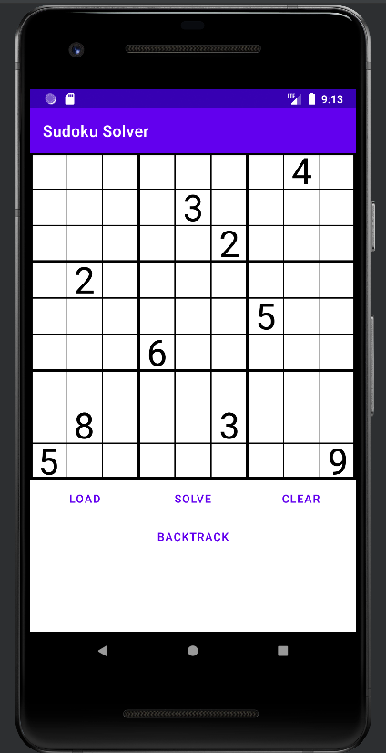
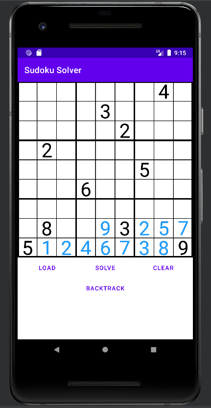
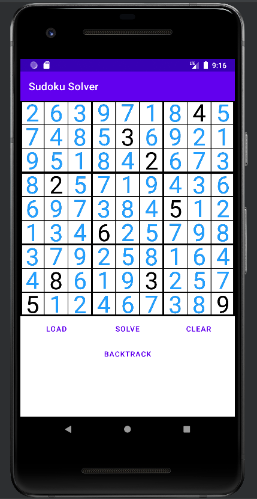

# Sudoku Solver
__Sudoku Solver__ is a simple sudoku solver for android

## Features
* Import custom Sudoku puzzles
* Observe the process of solving
* Light & minimal


## Screenshots
<p float="left">
    
    
    
</p>

## Sudoku File Format
You should provide a `.txt` file format.

For example:
```
*,*,*,*,*,*,*,4,*
*,*,*,*,3,*,*,*,*
*,*,*,*,*,2,*,*,*
*,2,*,*,*,*,*,*,*
*,*,*,*,*,*,5,*,*
*,*,*,6,*,*,*,*,*
*,*,*,*,*,*,*,*,*
*,8,*,*,*,3,*,*,*
5,*,*,*,*,*,*,*,9
```